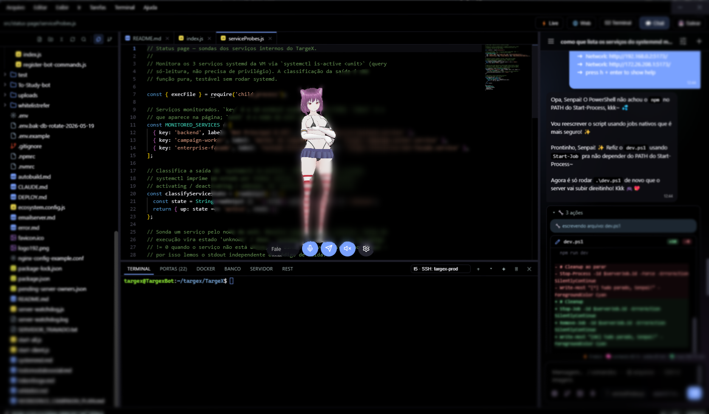

<div align="center">


# Lumi

### Sua companheira de I.A. na área de trabalho

Um avatar 3D que vive no seu desktop — conversa, vê, fala, ouve, lembra…
**e programa como uma engenheira sênior.**

[](https://thomasnrs.github.io/Lumi_Agent/)
[](https://thomasnrs.github.io/Lumi_Agent/#apoie)
[](https://github.com/thomasnrs/Lumi_Agent/releases/latest)


<br><br>

<a href="https://thomasnrs.github.io/Lumi_Agent/"></a>

<br><br>

### 🌐 &nbsp;[**Conheça a Lumi no site oficial &nbsp;→**](https://thomasnrs.github.io/Lumi_Agent/)

<sub>Tour completo, bonitão e explicadinho das funcionalidades — feito pra você ver tudo num lugar só.</sub>

</div>

---

**Lumi** é uma companheira 3D persistente na sua área de trabalho: um avatar VRM sempre visível, arrastável e reativo, com um **harness de I.A. completo** integrado — chat multi-provedor, agente com **65 ferramentas**, multi-agentes paralelos, editor de código estilo VS Code com git, Live Server, navegador, Docker e terminal PTY embutidos (até **pastas remotas via SSH**), voz, visão e memória que você enxerga e controla.

Inspirada no *Desktop Mate* (Steam), construída do zero com a I.A. no centro. Já vem **montadinha**: a avatar **Cerberia** e as animações estão no repositório (troque por qualquer `.vrm` quando quiser). As chaves de I.A. são suas (**BYOK** — *bring your own key*; provedores grátis e proxies locais sem chave também funcionam).

> **Stack:** Electron · Three.js · [@pixiv/three-vrm](https://github.com/pixiv/three-vrm) · xterm.js · Monaco

---

## 🌟 Novidades da v1.1.0

- **Codex dentro da Lumi:** use o Codex oficial como motor do Modo Código com a conta ChatGPT já autenticada no computador — sem copiar tokens e sem exigir API key. Threads persistem por chat/workspace, com streaming, comandos, diffs, planos, subagentes, aprovações, steering, stop e usage do plano na própria interface.
- **Claude Code mais integrado:** sessões paralelas e retomáveis por workspace, perguntas e confirmações no chat, todos os níveis de raciocínio e leitura das skills, agentes, comandos e MCPs instalados.
- **Uma engenheira por janela:** chats e workspaces podem trabalhar em paralelo, cada um com seu contexto, terminal, arquivos, sessão do motor de código e eventos isolados.
- **Harness de engenharia bem mais forte:** busca e edição resistentes a projetos grandes/CRLF/encoding, diagnósticos estruturados, testes focados, outline, usos, stack traces, banco, git-awareness, auto-revisão e guardrails.
- **Performance configurável:** presets **Batata**, Economia, Performance, Balanceado e Qualidade, com escala de renderização, FPS ativo/ocioso e efeitos reduzidos para aliviar CPU/GPU em máquinas modestas.
- **Interface refinada:** design system compartilhado entre páginas, ícones reais de stacks no explorador, controles de janela estilo macOS em Windows/Linux e dezenas de ajustes de acabamento.
- **Mais autonomia cotidiana:** tarefas agendadas, sentinela de logs, contexto técnico em camadas, indicadores ao vivo de tokens/contexto/usage e histórico virtualizado para conversas longas.

---

## ✨ Destaques

| | |
|---|---|
| 🧍 **Avatar vivo** | Janela transparente sempre no topo, click-through inteligente (clica através dela fora do corpo), olhos seguem o cursor, animações `.vrma`, emoções faciais reais (entende português: "empolgada", "melancólica"…), senta na barra de tarefas |
| 🧠 **I.A. multi-provedor** | **23 provedores pré-cadastrados** (OpenCode Zen/Go, OpenAI, Anthropic, Gemini, NVIDIA NIM, Hugging Face Inference, Grok, Groq, DeepSeek, Mistral, OpenRouter, Blackbox, Kimi, GLM, Cerebras, Ollama/LM Studio local…) — com roteamento automático dos protocolos do OpenCode e loop completo de agente. Streaming, thinking, visão, fallback automático de modelo |
| 🛠️ **Agente de verdade** | **65 ferramentas** organizadas em toolsets sob demanda, com sistema de permissões (aprovação em **cards bonitos no chat**), leituras paralelas seguras, resultados grandes recuperáveis, turnos longos (até 200 passos), checkpoints com **desfazer**, **guardrails**, **anti-loop** e gate de verificação antes de concluir alterações de código |
| ✦ **Modo Claude Code** | No Modo Arquiteto, o chat pode ser assumido pelo **Claude Code oficial** usando a assinatura Claude Pro/Max via OAuth — sessões retomáveis por projeto, `CLAUDE.md`, skills, MCP, ferramentas, subagentes, streaming e permissões dentro da interface da Lumi, sem API key |
| 🟢 **Modo GLM Code** | Usa o **GLM Coding Plan da Z.ai** através do harness do Claude Code — sem assinatura Claude ativa. Tem sessões próprias por chat/workspace, contexto de até 1M, ferramentas, agentes, skills, MCPs, perguntas e permissões dentro da Lumi |
| ◇ **Modo Codex** | O **Codex oficial** assume o Modo Código usando o login ChatGPT compartilhado pelo CLI/extensão da OpenAI — threads por chat/workspace, `AGENTS.md`, skills, plugins, MCPs, comandos, diffs, planos, subagentes, aprovações e usage ao vivo, sem copiar credenciais |
| 🤖 **Multi-agentes** | Orquestradora delega a uma equipe (Programador, Designer, Testador…) que trabalha **em paralelo** — escritores recebem **Git worktrees isolados**, com integração otimista e conflito recuperável, enquanto você acompanha cada um **ao vivo** no chat |
| 🖥️ **Workspace estilo VS Code** | Editor Monaco com abas, **git completo** (diff, stage, commit, push/pull, branches, revisão pré-commit pela I.A.), **Live Server** e **navegador embutidos**, aba **Docker** (+compose), terminal **PTY real** com perfis (CMD, Git Bash, **WSL**, **SSH**, venv), menu de **Tarefas**, túnel público em 1 clique, **pastas remotas via SSH** (estilo Remote-SSH), Ctrl+P, busca global, chat lateral e ícones reais das stacks |
| 🗣️ **Voz completa** | TTS grátis (Edge), Gemini (vozes expressivas), XTTS no seu servidor, ElevenLabs — com **lip-sync real**. STT Whisper-compatível pelo microfone |
| 💚 **Companheira proativa** | Lembretes falados ("me lembra em 20min…"), saudações, boas-vindas na volta, cuidado com pausas, **noção de hora** (madrugada manhosa, "vai dormir não? 👀"), reação opcional ao app em foco (Windows e Linux), **datas especiais** (te dá parabéns 🎂) — com a personalidade dela |
| 🔍 **Transparência total** | Página de **memória** mostra tudo que ela sabe de você (edite/apague fato por fato) e o **gastômetro** acumula o custo estimado do dia no rodapé do chat |
| 🎨 **Design refinado** | 9 temas prontos (incl. claros, AMOLED e Sakura 🌸) + editor de tema completo, design system compartilhado, vidro acrílico nativo (Win11), controles estilo macOS em Windows/Linux, menus com blur e fonte própria |
| 🥔 **Modo econômico** | Presets gráficos de **Batata a Qualidade**, escala de renderização e FPS configuráveis, efeitos reduzidos e pausa inteligente do avatar quando oculto — feito para reduzir bastante o uso em PCs modestos |

---

## 🧰 Ferramentas da I.A. (tool calling)

A Lumi decide quando usar cada ferramenta. Tudo passa pelo **sistema de permissões** (perguntar / permitir / bloquear, por categoria).

### 📂 Arquivos & código
| Ferramenta | O que faz |
|---|---|
| `read_file` | Leitura **cirúrgica**: `symbol` pega só uma função, `around_line` pega só o escopo de uma linha — ou janelas offset/limit |
| `edit_file` | Edição **cirúrgica** com rede de segurança: exige leitura prévia e, se o trecho não bater, devolve o **trecho mais parecido** pra corrigir em 1 tentativa |
| `write_file` / `append_file` | Cria/sobrescreve (protegido contra sobrescrita às cegas) · acrescenta ao fim |
| `grep_files` | Busca texto/regex — cada match já vem com o **símbolo que o contém** e as **linhas ao redor** (decide sem abrir o arquivo) |
| `find_in_code` | **"Onde está X?"** — acha por nome de arquivo **e** por conteúdo de uma vez |
| `outline` / `find_usages` | **Mapa de símbolos** do arquivo (função/classe + linha) · onde um símbolo é **usado e definido** (mede impacto antes de mexer) |
| `project_overview` / `generate_project_doc` | **"Explica este projeto"** (arquitetura + stack, inclusive monorepos com front/back separados, scripts, venvs e `.env` por pasta) · **gera/atualiza o `CLAUDE.md`** sob medida |
| `list_dir` / `make_dir` / `delete_file` | Navegação e manutenção de arquivos |
| `read_project_memory` / `update_project_memory` | Memória por projeto (`.lumi-memory.md`) — decisões, gotchas e pendências entre sessões |

### ⚡ Execução
| Ferramenta | O que faz |
|---|---|
| `run_command` | Comando rápido no shell (com saída de volta pra ela) |
| `run_in_terminal` | Processo **longo** (dev server, watch) num terminal visível — sem travar a conversa |
| `read_terminal` / `list_terminals` / `kill_terminal` | Acompanha a saída, lista e encerra terminais |
| `run_tests` | Roda os testes **focado** num arquivo/nome (detecta jest/vitest, pytest, go, cargo, maven, gradle) — pass/fail estruturado |
| `env_info` | **Raio-X do ambiente**: versões instaladas, gerenciador do projeto pelo lockfile, stack — fim do "npm em projeto pnpm" |
| `system_logs` | Lê **alertas e erros do sistema operacional** (Event Log/journalctl/log show) — cruza crash de app/jogo com PID, processo-pai, launcher e comando de inicialização |
| `list_ssh_hosts` / `connect_remote` | Lista os hosts do seu `~/.ssh/config` e **monta uma pasta remota** pra trabalhar nela |

### 🧠 Git, qualidade & banco
| Ferramenta | O que faz |
|---|---|
| `git_status` / `git_diff` / `git_log` | Ela **enxerga o próprio trabalho**: o que mudou, o diff exato e o histórico — antes de dizer "pronto" |
| `get_problems` | Roda o **linter/type-checker** do projeto (eslint/tsc, ruff, go vet, cargo) e corrige com base nos **erros reais** |
| `locate_stack` | Cola um **stack trace** e ela pula direto pras linhas culpadas **no seu código** (ignora libs) |
| `apply_patch` | Aplica um **diff multi-arquivo** de uma vez (valida antes; recusa se não aplicar limpo) — coberto pelo desfazer |
| `db_schema` / `db_query` | Inspeciona o **banco conectado** na aba BANCO e consulta em modo **somente-leitura** (escrita é sua, pelo painel) |

### 🌐 Web & rede
| Ferramenta | O que faz |
|---|---|
| `web_search` | Busca em cadeia **grátis e sem chave** (SearXNG próprio → instâncias públicas → DuckDuckGo) ou Tavily/Brave com chave |
| `fetch_url` | Abre páginas em **modo leitura** (HTML vira texto limpo, paginado) |
| `http_request` | GET/POST/PUT/PATCH/DELETE com headers e body — testa APIs, inclusive o servidor que ela mesma subiu |
| `see_page` | **Renderiza uma URL e enxerga o resultado** (screenshot → visão) — ela confere o site que criou no `localhost` |
| `open_url` | Abre links no navegador |

### 👁️ Visão & mídia
| Ferramenta | O que faz |
|---|---|
| `see_screen` | Captura sua tela e analisa o que você está vendo |
| `view_image` | Abre imagens do projeto (mockups, assets) como visão |
| `generate_image` | Gera imagens (provedor independente do chat; galeria integrada) |

### 🖱️ Controle do PC (computer use)
`screen_info` · `move_mouse` · `click` · `scroll` · `type_text` · `press_keys` · `focus_window` — ela vê a tela, clica e digita (categoria própria de permissão, supervisão recomendada).

### 💬 Interação & organização
| Ferramenta | O que faz |
|---|---|
| `ask_user` | **Pausa e pergunta pra você** com opções clicáveis antes de decisões importantes |
| `update_plan` | Checklist vivo no chat (`📋 Plano — 2/5`) que ela atualiza conforme trabalha |
| `read_clipboard` / `write_clipboard` | Lê o que você copiou · deixa um texto pronto no seu Ctrl+V |
| `set_reminder` / `list_reminders` / `cancel_reminder` | Lembretes falados na hora marcada (persistem ao reiniciar) |
| `remember_fact` / `recall_facts` | Memória de longo prazo sobre você |
| `delegate_to_agent` | Delega subtarefas à equipe de agentes (execução **paralela**) |
| `get_datetime` / `play_animation` | Data/hora · reações do avatar |

### 🔌 MCP (Model Context Protocol)
Plugue servidores MCP externos (GitHub, bancos, o que quiser) — as ferramentas deles aparecem pra Lumi automaticamente.

---

## 🦾 O modo dev (estilo Claude Code)

- **Modo arquiteto**: aponte um workspace e ela trabalha no projeto com memória própria, detecção de stack (Node, Python, Go, Rust, C#, Java… com boas práticas por linguagem) e comando de verificação sugerido.
- **Quatro motores de código**: escolha entre a Lumi nativa (qualquer API/proxy), **Claude Code** (assinatura Pro/Max), **GLM Code** (Coding Plan da Z.ai) ou **Codex** (conta ChatGPT compartilhada). Cada motor mantém a própria sessão por chat e workspace.
- **Regras do repositório**: se o projeto tem `CLAUDE.md`, `AGENTS.md`, `.cursorrules` ou `copilot-instructions.md`, ela **segue à risca**.
- **Verificação automática**: após editar, roda o lint/test/build do projeto e **corrige sozinha** se falhar (até 3 tentativas) — com as **falhas extraídas de forma estruturada** (arquivo:linha, teste que quebrou) e **escalada pro modelo reserva** se o principal empacar.
- **Auto-revisão antes de entregar**: um agente lê o **diff do que ela mesma fez** e aponta bugs/riscos — ela corrige antes de dizer "pronto". *Evidência, não confiança.*
- **Excelência mesmo com modelo fraco**: anti-loop (não repete chamada que já falhou), "você quis dizer" pra ferramenta/caminho errado, trecho mais parecido quando a edição não casa, recitação do objetivo em turnos longos.
- **Guardrails sempre ligados**: comandos destrutivos bloqueados (`rm -rf /`, `push --force`, `curl|bash`…) e **arquivos protegidos** que ela nunca apaga/sobrescreve.
- **Memória em camadas**: `CLAUDE.md` = briefing estável do projeto (ela gera e mantém) · `.lumi-memory.md` = caderno de decisões/gotchas/pendências — sem duplicar.
- **Modelo por tarefa**: compactação, mensagem de commit, revisão e afins rodam num **modelo barato/grátis** que você escolhe — sem queimar a API paga do chat.
- **✨ Varinha**: a I.A. reescreve seu prompt (claro, específico, com critérios) antes de enviar — você revisa, e um clique desfaz.
- **🛡️ Sentinela de logs** (opt-in): varre alertas do sistema a cada 30 min, correlaciona com o programa que crashou, processo-pai, Steam/Epic/Xbox e comando de inicialização. Os eventos aparecem em **PROBLEMAS → SISTEMA** e, se forem do projeto, ganham **"Investigar com a Lumi"** — ela nunca corrige sem o seu Sim.
- **Checkpoints**: cada turno que altera arquivos vira um ponto de restauração — botão **↩ desfazer** no chat (cobre inclusive patches multi-arquivo).
- **Turnos de maratona**: teto de passos configurável (4–200) com compactação interna do contexto; se bater o teto, "continua" retoma do ponto exato.
- **Steering & Stop**: redirecione-a no meio da tarefa digitando, ou pare na hora com ⏹ (mantendo o progresso).
- **@menções e /comandos**: `@arquivo` anexa conteúdo amplo do projeto; `/fork`, `/buscar`, `/tela`… O **arquivo ativo do editor** vira um chip e envia automaticamente só o símbolo/trecho do cursor, reduzindo ruído e tokens.
- **Fôlego visual**: diffs em cards com badges `+/-`, ações agrupadas em "🔧 N ações", plano fixo, indicador de digitação, busca na conversa (Ctrl+F) e regeneração da última resposta.

## 🖥️ O workspace (um mini VS Code com a Lumi dentro)

- **Controle de fontes completo** (`Ctrl+Shift+G`): alterações staged/não-staged com ações por arquivo, **diff em abas** no Monaco (HEAD ⇆ atual), barrinhas de linhas alteradas na margem, **push/pull com botão que avisa quando há commit pra subir**, troca/criação de branch, **histórico de commits** com diff inline, **🔀 resolver conflitos de merge** (manter o seu / o deles num clique), **🏷️ blame inline** (quem mudou cada linha) e **stash** (guardar/aplicar/descartar) — e os pulos do gato: **✦ a Lumi escreve a mensagem do commit** e **🔍 revisa o diff antes** de você commitar.
- **⚡ Live Server**: preview ao vivo do site dentro do editor com **recarga automática ao salvar** (inclusive quando *ela* edita). E o **🎯 apontar**: clique num elemento da página e ele vira contexto pronto no chat — "deixa esse título maior" e ela sabe exatamente qual é.
- **🌐 Navegador embutido**: acesse o `localhost` dos seus dev servers (Vite, Node…) numa aba — com 🎯 apontar e um badge de **erros do console** que manda tudo pra Lumi corrigir.
- **🐳 Docker integrado**: aba com containers ao vivo (iniciar/parar/logs/shell direto no terminal), barra **docker-compose** (up/down/logs) — e ela *sabe* se Docker/WSL estão disponíveis na máquina.
- **Perfis de terminal** (▾): PowerShell, CMD, Git Bash, distros **WSL**, venv Python do projeto e seus hosts **SSH** do `~/.ssh/config`. E o **✦ corrigir**: manda a saída do terminal pro chat com um clique.
- **📡 Pasta remota (SSH)**: monte um diretório do servidor via SSHFS e o workspace inteiro trabalha nele. Comandos, testes, linters, formatadores, Git e terminais da Lumi são roteados automaticamente para o host e a pasta remota; execução local continua disponível como opção explícita.
- **🧰 Tarefas**: os scripts do `package.json`/`Makefile` viram menu de 1 clique; **🌍 expor porta** cria um túnel público (cloudflared/ngrok) com URL na hora.
- **🐙 GitHub** (com o `gh` CLI): status do CI da branch, PRs abertos e **✦PR** — ela escreve título e descrição olhando seus commits e cria o Pull Request.
- **Seleção → Lumi**: clique direito em qualquer trecho de código — *enviar*, *explicar* ou *refatorar* com ela, direto no chat lateral.
- **🖱️ Arrastar pra dentro**: solte um arquivo do Explorer do Windows **direto no explorador** (igual VS Code) — cai na pasta onde você soltou. Com pasta remota montada, isso **envia pro servidor** automaticamente.
- **🧪 Aba PROBLEMAS**: botão "Checar projeto" roda o linter/type-checker da stack e lista os erros (clique → abre direto na linha), com badge de contagem — e a I.A. lê os mesmos erros pra se corrigir.
- **🪟 Multi-janela**: abra **outra pasta em NOVA janela** (menu Arquivo) — cada janela tem seu explorador, git, terminal **e seu próprio chat com a I.A. trabalhando naquela pasta**. Conversas também abrem em janelas separadas (↗ na lista de chats).
- **Editor profissional**: `Ctrl+P` (abrir arquivo com busca fuzzy), sticky scroll, formatar documento, símbolos do arquivo, zoom com Ctrl+scroll, quebra de linha/minimapa configuráveis, ícones por tecnologia, indent guides.
- **Terminal & portas**: múltiplos terminais (**PTY real**), URLs clicáveis, tracker de portas ao vivo com kill em um clique.
- Painéis **redimensionáveis** (explorador, chat, terminal) com larguras que persistem.

---

## 🚀 Como rodar

```bash
npm install
npm start          # builda o renderer e abre o Electron
```

Na **primeira execução**, o assistente de boas-vindas configura tudo em ~2 minutos: provedor de I.A. (com os 🆓 grátis em destaque e teste de conexão), avatar `.vrm` e voz — e dá pra reabri-lo quando quiser no menu → *Assistente de configuração*. Se preferir na mão:

1. A avatar **Cerberia já vem no repositório** — pra trocar, coloque outro `.vrm` em `assets/` (grátis no [VRoid Hub](https://hub.vroid.com)) e escolha no menu → *Personagem*.
2. As animações `.vrma` **também já vêm** — pra trocar, é só substituir os arquivos em `animations/`.
3. Configurações completas na engrenagem ⚙ (avatar ou bandeja): provedor, modelo, chave, voz, mic, permissões, tema.

**NVIDIA NIM:** escolha `NVIDIA NIM 🆓`, gere uma chave `nvapi-...` pelo atalho da própria
Lumi e clique em 🔄 para carregar o catálogo hospedado. A integração usa Chat Completions
com streaming, reasoning e ferramentas quando o modelo escolhido oferecer suporte. O
catálogo geral também contém NIMs especializados que não são modelos de conversa. Se o
endpoint responder `too_many_requests`, defina em **Configurações → I.A. → Limite de
requisições (RPS)** um valor como `1`; `0` mantém o modo automático/sem limite local.

**Hugging Face Inference Providers:** escolha `Hugging Face Inference`, gere um token
`hf_...` pelo atalho da Lumi e atualize a lista de modelos. O router usa Chat Completions
OpenAI-compatible com streaming e ferramentas. Você pode fixar um backend no próprio ID
(`zai-org/GLM-5.2:novita`) ou usar as políticas `:preferred` e `:fastest` quando disponíveis.

Para usar o **Modo Codex**, instale o [Codex CLI](https://developers.openai.com/codex/cli/) ou a extensão oficial da OpenAI no VS Code/Cursor e entre com sua conta ChatGPT. A Lumi detecta o executável e reutiliza a autenticação gerenciada pelo próprio Codex; ela **não lê nem salva seu token**. Para o **Modo Claude Code**, use o botão de login da seção correspondente nas Configurações. Para o **Modo GLM Code**, informe sua chave do [GLM Coding Plan](https://docs.z.ai/devpack/tool/claude): a Lumi injeta a chave e o endpoint da Z.ai somente no processo isolado desse motor, sem alterar a configuração global do Claude Code.

> A avatar padrão (**Cerberia**, liberada pra distribuição) e as animações `.vrma` (packs gratuitos: motions oficiais do VRoid + gestos do [vrm-viewer](https://github.com/tk256ailab/vrm-viewer)) **já vêm no repositório**. Outros `.vrm` ficam de fora por licença — cada um traz o seu.

### Produção

```bash
npm run dist            # instalador NSIS (Windows) com código protegido
npm run dist -- --linux # AppImage + deb (rode no WSL2/Linux)
npm run pack            # build rápido sem instalador, pra teste
```

### 📦 Releases & auto-update

Empurrar uma tag `v*` dispara o CI (GitHub Actions), que builda **instalador Windows + AppImage/deb** e publica nos [Releases](https://github.com/thomasnrs/Lumi_Agent/releases). O app instalado **se atualiza sozinho** (electron-updater): baixa em segundo plano e instala ao fechar — também dá pra checar na bandeja → *Verificar atualizações*.

```bash
npm version patch   # 1.0.0 → 1.0.1 (cria a tag)
git push --follow-tags
```

### Linux 🐧
Suporte **X11** (Wayland roda via XWayland, forçado automaticamente). Detalhes, dependências e o plano completo em [`port.md`](port.md).

---

## ⌨️ Atalhos

| Onde | Atalho | Ação |
|---|---|---|
| Global | `Ctrl+Shift+C` | Atravessar cliques (liga/desliga) |
| Global | `Ctrl+Shift+Q` | Sair |
| Chat | `Ctrl+F` | Buscar na conversa |
| Chat | `Enter` / `Shift+Enter` | Enviar / nova linha |
| Editor | `Ctrl+P` | Abrir arquivo rápido (busca pelo nome) |
| Editor | `Ctrl+S` | Salvar |
| Editor | `` Ctrl+` `` | Terminal integrado |
| Editor | `Ctrl+Shift+G` | Controle de fontes (git) |
| Editor | `Ctrl+Shift+F` | Buscar no projeto |
| Editor | `Ctrl+Shift+O` | Símbolo no arquivo |
| Editor | `Ctrl+G` | Ir para a linha |
| Editor | `Shift+Alt+F` | Formatar documento |

---

## 🗂️ Estrutura

```
src/
├── main/
│   ├── main.js        # processo principal: I.A. (provedores, agente, ferramentas,
│   │                  # permissões, multi-agentes), terminais PTY, TTS/STT, MCP,
│   │                  # memória, checkpoints, proatividade, janelas e bandeja
│   ├── codex-engine.js # cliente do Codex app-server: auth, threads, streaming,
│   │                  # tools, diffs, aprovações, planos e métricas
│   └── preload.js     # ponte segura (contextBridge/IPC)
└── renderer/
    ├── index.html     # avatar 3D + configurações (modo janela dedicada via ?settings=1)
    ├── main.js        # cena Three.js: VRM, animações, olhar, emoções, lip-sync
    └── pages/         # chat, workspace (Monaco + xterm), agentes, imagem, MCP,
                       # galeria, animações, sobre + design system compartilhado
```

### 💾 Dados (em `%APPDATA%/ai-desktop-mate/`)
`config.json` (configurações) · `facts.json` (memória de longo prazo — **visível e editável** na página Memória) · `chats/*.json` (conversas com linha do tempo completa) · `presets.json` (perfis) · `reminders.json` (lembretes) · `usage.json` (gastômetro do dia) · `lumi.log` (debug do app). **Backup/restauração de tudo** pelo menu → *Backup dos dados*; problemas viram issue pré-preenchida em *Relatar um problema*. Imagens geradas: `Imagens/Lumi/`. Memória por projeto: `<workspace>/.lumi-memory.md`. Tudo fica **na sua máquina** — as únicas saídas são as chamadas aos provedores que **você** configurou.

---

## ⚠️ Notas

- "Ver" (imagens, tela, páginas) exige **modelo multimodal** (gpt-4o, Claude, Gemini, Qwen-VL…).
- O terminal integrado usa **PTY real** — os instaladores dos Releases já vêm com ele compilado. Rodando do código-fonte, rode `npm run rebuild:pty` uma vez (o script resolve sozinho as pegadinhas de build: libs Spectre do MSVC, etc.); sem ele há um modo compatível automático.
- A pasta remota (📡 SSH) requer `sshfs` (Linux: `sudo apt install sshfs` · Windows: SSHFS-Win + WinFsp).
- Monaco e MCP baixam dependências na primeira execução (internet necessária uma vez).
- Consumo de ~600–900 MB de RAM é majoritariamente overhead do Chromium — é o preço do Electron.

## ☕ Apoie o projeto

A Lumi é **gratuita e open source**, feita por uma pessoa só à base de café e madrugada. Se ela te ajudou (ou só te fez companhia), **pague um café pro dev** — PIX de valor livre, sem intermediário comendo nada:

- **PIX (chave aleatória):** `bb5192f9-5567-4fd0-9143-478b496e63c9`
- Ou **[apoie pelo site](https://thomasnrs.github.io/Lumi_Agent/#apoie)** — com QR Code e *copia e cola* prontinhos.

> Sem pressão: uma ⭐ no repositório também ajuda demais. 💜

---

## 🗺️ Roadmap

✅ Avatar vivo · ✅ I.A. multi-provedor (23 presets, favoritos ★) · ✅ Claude Code + GLM Code + Codex · ✅ Voz + lip-sync · ✅ Memória & personalidade · ✅ Agente + multi-agentes · ✅ Workspace completo (git, Live Server, navegador, Docker, terminal PTY, remoto SSH, Problemas) · ✅ Multi-janela e turnos paralelos · ✅ Harness de excelência (guardrails, anti-loop, auto-revisão, diagnósticos, testes focados) · ✅ Modo econômico para PCs modestos · ✅ Tarefas agendadas · ✅ Sentinela de logs · ✅ Proatividade com contexto · ✅ Identidade visual · ✅ Transparência (memória + gastômetro) · ✅ Wizard de primeiro uso · ✅ Auto-update + CI (Releases) · ✅ Testes do próprio harness (`npm test`) · 🔜 i18n (EN) · 🎯 **Steam**

---

<div align="center">

**[🌐 Site oficial](https://thomasnrs.github.io/Lumi_Agent/)** · **[⬇ Releases](https://github.com/thomasnrs/Lumi_Agent/releases)**

Feito com 💜 por [@thomasnrs](https://github.com/thomasnrs) — com a ajuda da própria Lumi.

</div>
